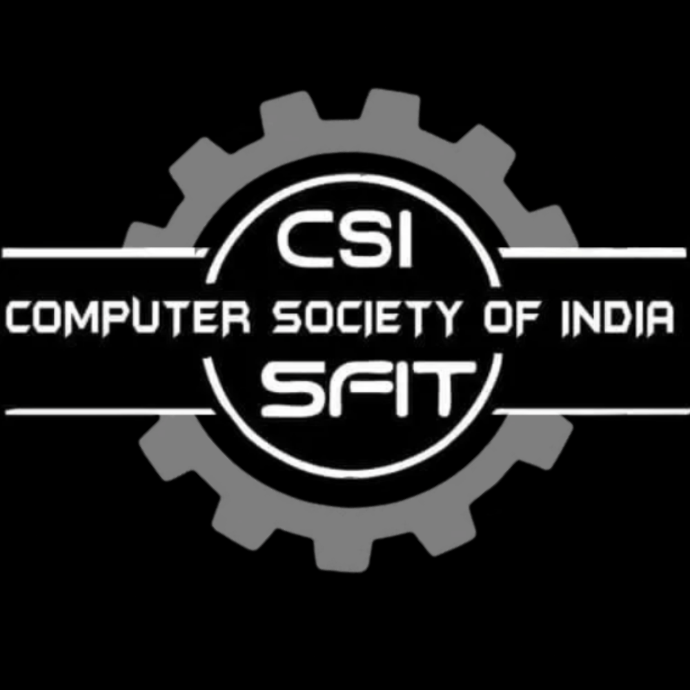

<table width="100%">
<tr>
<td>

# Computer Society of India (CSI) - SFIT  
## St. Francis Institute of Technology - Student Chapter

</td>
<td align="center" width="200">
    
</td>
</tr>
</table>

[](https://github.com/AnleaMJ/csi-sfit/actions/workflows/ci-cd-netlify.yml)
[](https://app.netlify.com/projects/sfit-csi/deploys)
---

## About

**CSI SFIT** is the official chapter of the [Computer Society of India (CSI)](https://www.csi-india.org/) at [St. Francis Institute of Technology (SFIT)](https://www.sfit.ac.in/).  
We are dedicated to fostering a vibrant community of students and professionals passionate about computing, technology, and innovation.

---

## Features

- 💻 Community-driven events, workshops & seminars
- 🚀 Technical projects and hackathons
- 🌐 Networking opportunities with industry experts
- 📚 Knowledge sharing sessions

---

## Getting Started

1. **Clone the repository**
   ```bash
   git clone https://github.com/AnleaMJ/csi-sfit.git
   ```
2. **Install dependencies**
   ```bash
   npm install
   ```
3. **Run the project locally**
   ```bash
   npm start
   ```

---

## Contributing

We welcome contributions!  
Please read the [contributing guidelines](CONTRIBUTING.md) to get started.

---

## License

This project is licensed under the [MIT License](LICENSE).

---

## Connect with Us

- [SFIT Website](https://www.sfit.ac.in/)
- [CSI India](https://www.csi-india.org/)
- [Contact the Maintainers](mailto:movefore@gmail.com)
